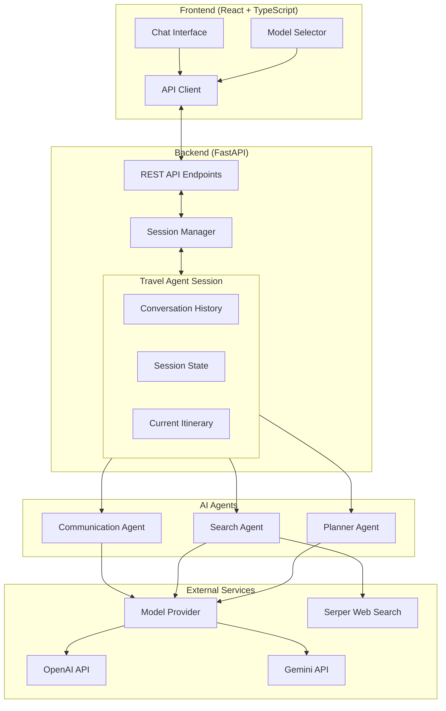
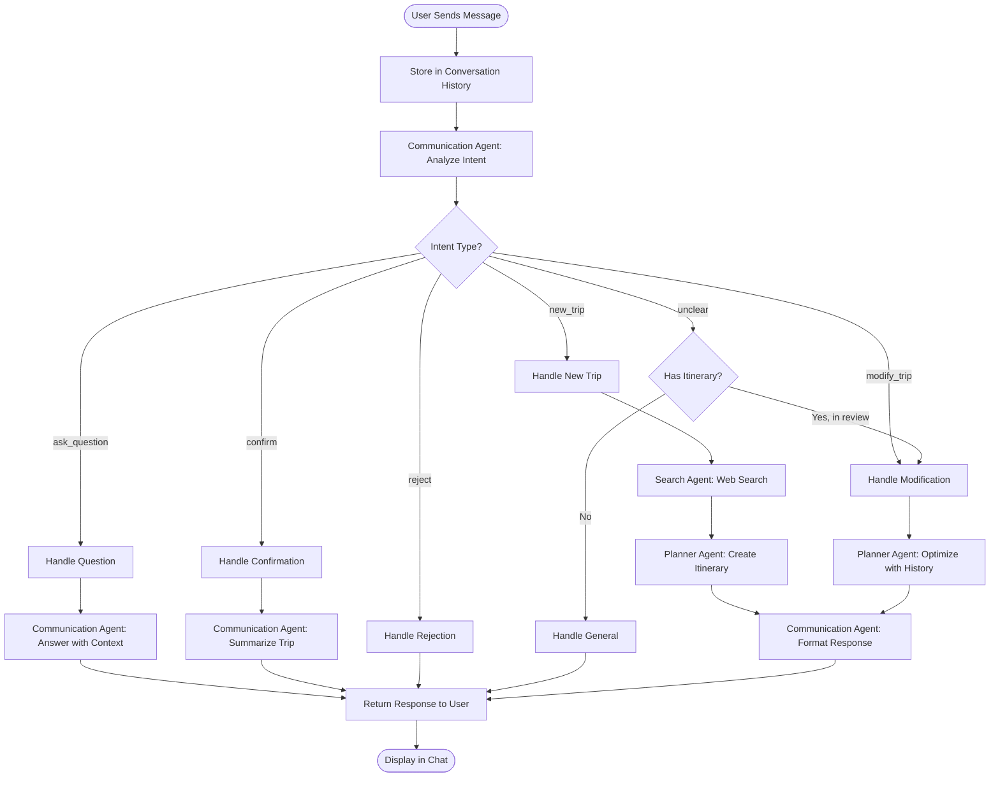
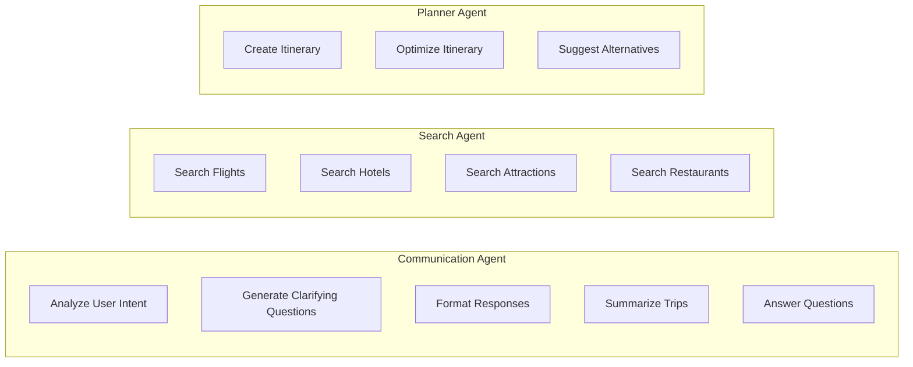
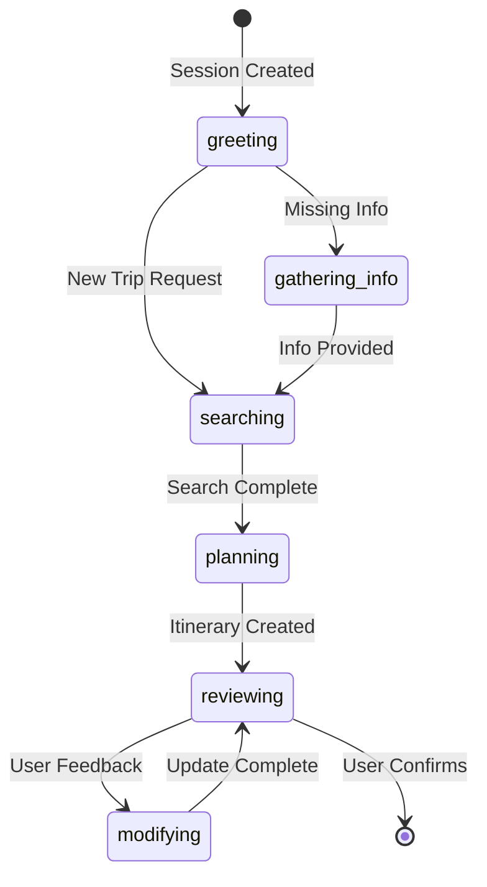

# Travel Agent AI - Application Flow

## Architecture Overview



## Message Processing Flow



## Agent Responsibilities



## Session State Machine



## API Endpoints

| Endpoint | Method | Description |
|----------|--------|-------------|
| `/` | GET | API info |
| `/health` | GET | Health check |
| `/api/chat` | POST | Send message to travel agent |
| `/api/reset` | POST | Reset chat session |
| `/api/models` | GET | Get available models |
| `/api/models` | POST | Change current model |

## Data Flow Example

```
User: "Plan a 5-day trip to Paris in April"
         │
         ▼
┌─────────────────────────────────────────┐
│  Communication Agent: Analyze Intent     │
│  → intent: "new_trip"                    │
│  → destination: "Paris"                  │
│  → dates: "April, 5 days"               │
└─────────────────────────────────────────┘
         │
         ▼
┌─────────────────────────────────────────┐
│  Search Agent: Web Search                │
│  → Flights to Paris                      │
│  → Hotels in Paris                       │
│  → Attractions in Paris                  │
│  → Restaurants in Paris                  │
└─────────────────────────────────────────┘
         │
         ▼
┌─────────────────────────────────────────┐
│  Planner Agent: Create Itinerary         │
│  → Day-by-day schedule                   │
│  → Hotel recommendations                 │
│  → Activity planning                     │
│  → Budget estimates                      │
└─────────────────────────────────────────┘
         │
         ▼
┌─────────────────────────────────────────┐
│  Communication Agent: Format Response    │
│  → Friendly, readable format             │
│  → Invitation for feedback               │
└─────────────────────────────────────────┘
         │
         ▼
    Response to User
```

## Technology Stack

```
┌────────────────────────────────────────────────────────┐
│                    FRONTEND                             │
│  React + TypeScript + Vite                             │
│  • Chat Interface                                       │
│  • Model Selection                                      │
│  • Markdown Rendering                                   │
└────────────────────────────────────────────────────────┘
                          │
                          │ HTTP/REST
                          ▼
┌────────────────────────────────────────────────────────┐
│                    BACKEND                              │
│  FastAPI + Python                                       │
│  • Session Management                                   │
│  • Agent Orchestration                                  │
│  • OpenAI Agents SDK Tracing                           │
└────────────────────────────────────────────────────────┘
                          │
              ┌───────────┼───────────┐
              ▼           ▼           ▼
        ┌─────────┐ ┌─────────┐ ┌─────────┐
        │ OpenAI  │ │ Gemini  │ │ Serper  │
        │   API   │ │   API   │ │   API   │
        └─────────┘ └─────────┘ └─────────┘
```
